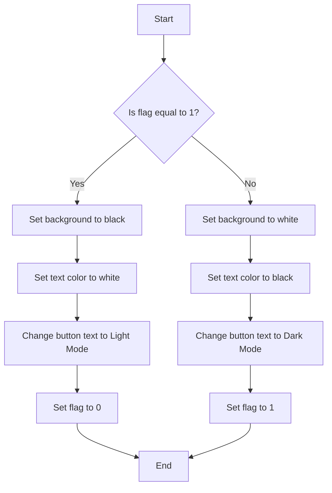

###  C Language Lecture 1: The Birth of Coding Simplicity

<p>"Every great journey begins with a single line of code."

Welcome to Lecture 1 of our C Programming course. If you're reading this, you're probably standing at the threshold of one of the most exciting adventures in technology: learning how to code.

Let’s start from the very beginning—what is C, why should you care, and how do you set up your computer to become a code-writing machine?</p>

### The Origin of C – A Bit of History

<p>Long before flashy user interfaces and mobile apps, there was C.</p>

- 🗓️ Year: 1972
- 👨‍🔬 Inventor: Dennis Ritchie
- 🏛️ Birthplace: Bell Labs

<p>C was created to develop the UNIX operating system—and it soon became the mother of modern programming languages. If you’ve heard of C++, Java, Python, or JavaScript, just know they all carry DNA from this elegant and powerful ancestor.</p>


## Why Learn C in 2025? Even in today's AI age, C is still:

- ⚙️ Close to hardware (perfect for embedded systems)

- ⚡ Super fast and lightweight

- 🧠 A brain trainer—makes you understand how computers actually think

<p>Learn C, and you'll never fear pointers, memory, or logic again.</p>

A **markup language** is a way of writing text so that **computers can understand the structure and meaning** of the content.

It **"marks up"** plain text with **tags** that describe **how the text should appear or behave**.

### 📌 Example (Plain Text vs Markup):

Plain Text:
This is heading.
This is a paragraph
with markup (HTML):
```javascript

<h1>This is a heading</h1>
<p>This is a paragraph.</p>

```

Here, `<h1>` and `<p>` are **markup tags**. They tell the browser:

- "Hey! This part is a heading!"
    
- "And this part is a paragraph!"

### Why use a markup language?

- To organize content
    
- To add structure (like headers, lists, links)
    
- To format the content (like bold, italic)
    
- To make content readable by browsers and other machines (like screen readers)

### Common Markup Languages:

- **HTML** – For web pages
    
- **XML** – For storing and transporting data
    
- **Markdown** – For lightweight formatting (used in README files)


## Basic Structure

```javascript

<!DOCTYPE html>
<html>
  <head>
    <title>Page Title</title>
  </head>
  <body>
    <h1>This is a heading</h1>
    <p>This is a paragraph.</p>
  </body>
</html>


```

ID and CLASS

```javascript

<!DOCTYPE html>
<html lang="en">

<head>
    <meta charset="UTF-8">
    <meta name="viewport" content="width=device-width, initial-scale=1.0">
    <title>Document</title>
    <link rel="stylesheet" href="style.css">
</head>

<body>
    <div id="body">
        <div class="btn">dark mode</div>
        <p>Lorem ipsum dolor sit amet consectetur adipisicing elit. Offi</p>
    </div>

    <script src="script.js"></script>
</body>

</html>


```

Target ID and Class in CSS
```javascript
/* Target the class */
/* Base styles */
* {
    margin: 0;
    padding: 0;
    box-sizing: border-box;
    font-family: gilroy;
}

html,
body {
    height: 100%;
    width: 100%;
}

#body {
    background-color: white;
    width: 100vw;
    height: 100vh;
    margin: 0%;
    padding: 0%;
}

.btn {
    height: 20px;
    width: 80px;
    background-color: aqua;
    cursor: pointer;
}
  
```





```javascript


let flag = 1;
document.querySelector(".btn").addEventListener("click", function() {
    let B = document.querySelector("#body");
    let btn = document.querySelector(".btn");

    if (flag === 1) {
        // Switch to dark mode
        B.style.backgroundColor = "black";
        B.style.color = "white";
        btn.innerHTML = "Light Mode";
        flag = 0;
    } else {
        // Switch to light mode
        B.style.backgroundColor = "white";
        B.style.color = "black";
        btn.innerHTML = "Dark Mode";
        flag = 1;
    }
});


```

## Creative Design

Nam ut rutrum ex, venenatis sollicitudin urna. Aliquam erat volutpat. Integer eu ipsum sem. Ut bibendum lacus vestibulum maximus suscipit. Quisque vitae nibh iaculis neque blandit euismod.

> Lorem ipsum dolor sit amet consectetur adipisicing elit. Nemo vel ad consectetur ut aperiam. Itaque eligendi natus aperiam? Excepturi repellendus consequatur quibusdam optio expedita praesentium est adipisci dolorem ut eius!

Lorem ipsum dolor sit amet consectetur adipisicing elit. Nemo vel ad consectetur ut aperiam. Itaque eligendi natus aperiam? Excepturi repellendus consequatur quibusdam optio expedita praesentium est adipisci dolorem ut eius!