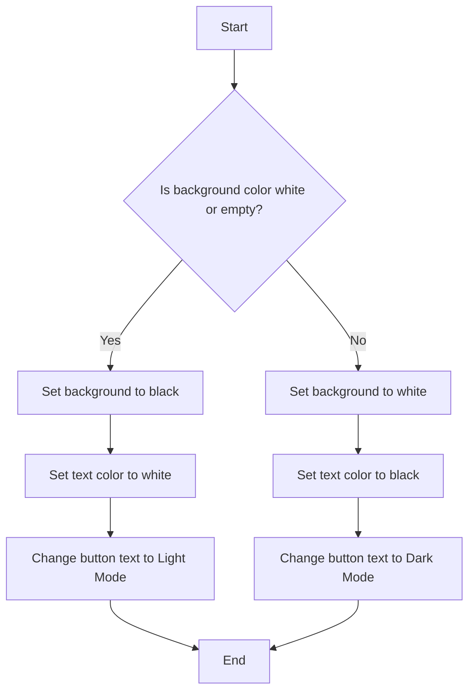

# HTML

### What is a Markup Language?

A **markup language** is a way of writing text so that **computers can understand the structure and meaning** of the content.

It **"marks up"** plain text with **tags** that describe **how the text should appear or behave**.

### 📌 Example (Plain Text vs Markup):

Plain Text:
This is heading.
This is a paragraph
with markup (HTML):
```javascript

<h1>This is a heading</h1>
<p>This is a paragraph.</p>

```

Here, `<h1>` and `<p>` are **markup tags**. They tell the browser:

- "Hey! This part is a heading!"
    
- "And this part is a paragraph!"

### Why use a markup language?

- To organize content
    
- To add structure (like headers, lists, links)
    
- To format the content (like bold, italic)
    
- To make content readable by browsers and other machines (like screen readers)

### Common Markup Languages:

- **HTML** – For web pages
    
- **XML** – For storing and transporting data
    
- **Markdown** – For lightweight formatting (used in README files)


## Basic Structure

```javascript

<!DOCTYPE html>
<html>
  <head>
    <title>Page Title</title>
  </head>
  <body>
    <h1>This is a heading</h1>
    <p>This is a paragraph.</p>
  </body>
</html>


```

ID and CLASS

```javascript

<!DOCTYPE html>
<html lang="en">
<head>
  <meta charset="UTF-8" />
  <meta name="viewport" content="width=device-width, initial-scale=1" />
  <title>Light / Dark Mode Toggle</title>
  <link rel="stylesheet" href="styles.css" />
</head>
<body class="light-mode">
  <div class="container">
    <h1>Welcome to Light/Dark Mode Demo</h1>
    <p>This is a simple example to toggle between light and dark modes.</p>
    <button id="toggleBtn">Switch to Dark Mode</button>
  </div>

  <script src="script.js"></script>
</body>
</html>


```

Target ID and Class in CSS
```javascript
/* Target the class */
/* Base styles */
body {
  font-family: Arial, sans-serif;
  transition: background-color 0.5s ease, color 0.5s ease;
  margin: 0;
  padding: 2rem;
}

.container {
  max-width: 600px;
  margin: auto;
  text-align: center;
  padding: 2rem;
  border-radius: 12px;
  box-shadow: 0 0 10px rgba(0,0,0,0.1);
}

/* Light Mode Styles */
.light-mode {
  background-color: #ffffff;
  color: #333333;
}

/* Dark Mode Styles */
.dark-mode {
  background-color: #121212;
  color: #e0e0e0;
}

/* Button styling */
button {
  padding: 10px 20px;
  font-size: 1rem;
  background-color: #008cba;
  color: white;
  border: none;
  border-radius: 6px;
  cursor: pointer;
  margin-top: 20px;
  transition: background-color 0.3s ease;
}

button:hover {
  background-color: #005f5f;
}

  
```





```javascript


const box = document.querySelector("#toggleBtn");
const body = document.body;

box.addEventListener("click", function() {

    if (body.style.backgroundColor === "white" || body.style.backgroundColor === "") {
        body.style.backgroundColor = "black";
        body.style.color = "white"; // make text visible in dark mode
        box.innerHTML = "Light Mode";
    } else {
        body.style.backgroundColor = "white";
        body.style.color = "black"; // reset text color for light mode
        box.innerHTML = "Dark Mode";
    }
});


```

## Creative Design

Nam ut rutrum ex, venenatis sollicitudin urna. Aliquam erat volutpat. Integer eu ipsum sem. Ut bibendum lacus vestibulum maximus suscipit. Quisque vitae nibh iaculis neque blandit euismod.

> Lorem ipsum dolor sit amet consectetur adipisicing elit. Nemo vel ad consectetur ut aperiam. Itaque eligendi natus aperiam? Excepturi repellendus consequatur quibusdam optio expedita praesentium est adipisci dolorem ut eius!

Lorem ipsum dolor sit amet consectetur adipisicing elit. Nemo vel ad consectetur ut aperiam. Itaque eligendi natus aperiam? Excepturi repellendus consequatur quibusdam optio expedita praesentium est adipisci dolorem ut eius!